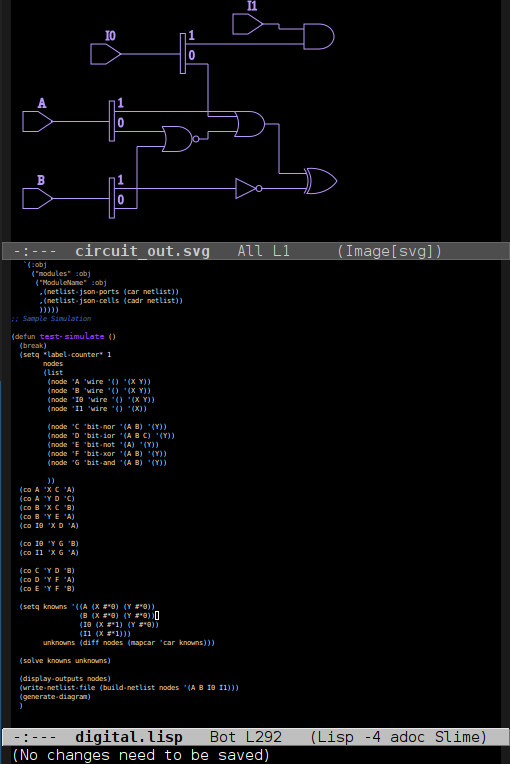

# CL-Digital
# Common Lisp Digital Hardware Synthesis and Simulation

* RTL Digital Hardware Design
* EDA Simulation and Schematic Drawing
* Digital Runtime Modeling in Common Lisp
* Circuit Drawing

# Requirements
* netlistsvg for vector schematic drawing http://github.com/nturley/netlistsvg
* JSOWN for netlist exports

# Use
* (load "digital.lisp")
* see TEST-SIMULATE in digital.lisp for sample

# Todo
* re-implement in Indigo http://github.com/olewhalehunter/indigo.lisp
* parts registration and layout planning, component libraries
